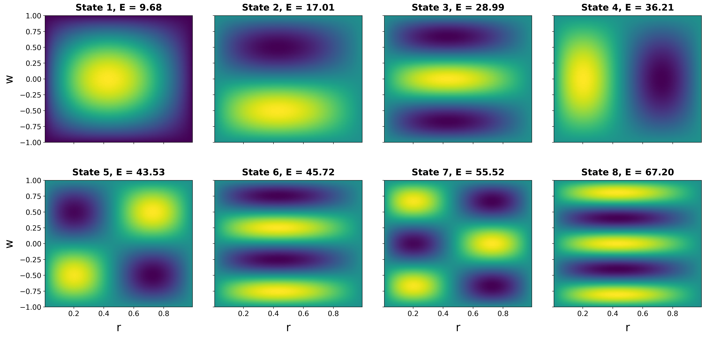

# Numerical Solver for 2D Light-Front Hamiltonian (QQ-bar Model)

This repository provides a high-performance numerical framework for calculating the mass spectrum and visualizing 2D wave functions of quark-antiquark ($q\bar{q}$) bound states. The implementation is based on the **Hamiltonian Light-Front QCD** formalism, specifically focusing on models with dynamical zero modes.



## 🔬 Theoretical Background

The solver addresses the eigenvalue problem for the Light-Front Hamiltonian. Unlike standard equal-time formulations, Light-Front dynamics allow for a consistent description of hadronic structures in terms of frame-independent wave functions.

### The Model
The physics implemented here follows the research of the Saint Petersburg theoretical physics school, detailed in the work of **R.A. Zubov** and **E.V. Prokhvatilov**. The model incorporates dynamical zero modes, which are crucial for capturing non-perturbative effects in QCD.

**Reference Paper:**
> Zubov, R. A., & Prokhvatilov, E. V. (2016). *Quark-antiquark model with dynamical zero modes on the light front.*  
> **arXiv:** [1609.07507](https://arxiv.org/abs/1609.07507)

## 🛠 Features & Engineering

* **Sparse Matrix Optimization:** Uses `scipy.sparse` and `scipy.sparse.linalg.eigsh` for efficient computation, allowing resolutions up to $256^2$ on consumer hardware.
* **Singularity Handling:** Implements a transformation of the wave function $\psi(r, w) \to u(r, w)/\sqrt{r}$ to ensure a Hermitian operator and stable convergence at $r \to 0$.
* **Kronecker Product Assembly:** 2D operators are constructed using tensor products of 1D finite-difference matrices, ensuring mathematical rigor and code readability.
* **Spectral Analysis:** Automated sorting and visualization of the first $N$ energy eigenstates.

## 🚀 Quick Start

### Prerequisites
- Python 3.13+
- NumPy
- SciPy
- Matplotlib

### Installation

#### UV (preferred)
```bash
uv venv
uv sync
uv run python main.py
```

#### Pip
```bash
pip install -r requirements.txt
python main.py
```

## ⚖️ Funding & Intellectual Property

This project was developed during a collaborative research period (2018–2019) between the **Saint Petersburg State University** and the **Institute of High Energy Physics (IHEP) of the Chinese Academy of Sciences**, supported by **CAS Grant #Y8299220K5**.

**Statement on Ownership:**
- **Code Autonomy:** The implementation provided in this repository was authored solely by Nikita Unkovsky. 
- **Publication Status:** This specific codebase has not been utilized in any official joint publications and remains the independent property of the author.
- **Academic Purpose:** The code is released under the MIT License for educational and research transparency purposes.
